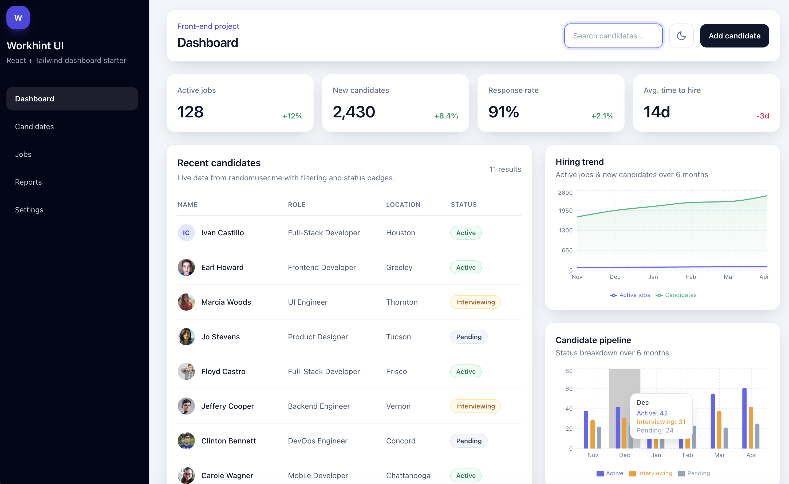

# Workhint UI — React + Tailwind Dashboard

**Live Demo:** [react-tailwind-dashboard-eight.vercel.app](https://react-tailwind-dashboard-eight.vercel.app)

## Preview


A fully interactive hiring dashboard built with React, Tailwind CSS, and live API integrations for real-time candidate and job data. No UI component library — every element is hand-crafted with Tailwind utility classes.

## Key Features

- Integrated live data from external REST APIs:
  - [RandomUser API](https://randomuser.me) for candidate data
  - [The Muse API](https://www.themuse.com/developers/api/v2) for real-time job listings
- Responsive multi-screen dashboard (mobile, tablet, desktop)
- Interactive data visualizations using Recharts
- Dark mode with persistent UI state
- Dynamic filtering, search, and client-side routing
- Add candidate modal with form validation and initials avatar fallback
- Animated loading skeletons while API data loads

## Pages

- **Dashboard** — stat cards, live candidate table, hiring trend area chart, candidate pipeline bar chart
- **Candidates** — full candidate list with search and status badges
- **Jobs** — live job listings from The Muse, filterable by level and keyword, with apply links
- **Reports** — 4 charts: hiring trend, candidate pipeline, response rate, time to hire
- **Settings** — placeholder, ready to extend

## Tech stack

| Tool | Purpose |
|------|---------|
| [React 18](https://react.dev) | UI and state management |
| [Vite](https://vitejs.dev) | Build tool and dev server |
| [Tailwind CSS v3](https://tailwindcss.com) | Styling |
| [Recharts](https://recharts.org) | Data visualization |
| [RandomUser API](https://randomuser.me) | Live candidate data |
| [The Muse API](https://www.themuse.com/developers/api/v2) | Live job listings |

## Getting started

```bash
npm install
npm run dev
```

## Production build

```bash
npm run build
npm run preview
```
